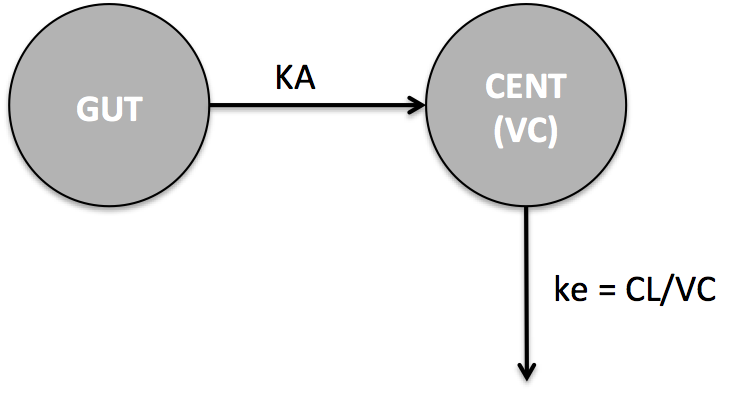

---
title: Introduction to <grn>mrgsolve</grn><BR>Model specification
author: Kyle T. Baron
date: Metrum Research Group, LLC
output: 
  slidy_presentation:
    number_sections: true
    css: [src/styles/slidystyles.css,src/styles/colors.css]
  html_document:
    theme: united
    number_sections: true
    toc: true
    css: [src/styles/htmlstyles.css,src/styles/colors.css]

---


```{r, include = FALSE}
source("src/global.R")
library(mrgsolve)
library(dplyr)
library(knitr)
library(lattice)
```

```{r setup, echo = FALSE, message = FALSE}
mod <- mread_cache("pk1", modlib()) %>% 
  update(end = 192, delta = 0.2) %>% Req(CP)
data(exidata)
data <- filter(exidata, ID <=10)
set.seed(1222)
```

# Let's make this model



> - What are the <grn>parameters</grn>?
> - What are the <blu>compartments</blu>?
> - What are the <purp>differential equations</purp>?


# Code up the model


# $PARAM [`R`] __declare and initialize model parameters__
```{r, eval=FALSE}
$PARAM CL = 1, VC = 20, KA=1.2
```


* Model "parameters" with `name = value` format
* Separate by `,` or `<newline>`
* Use any `name` except for words in `mrgsolve:::reserved()`
* Values are evaluated by `R` parser
* Multiple blocks allowed
* Use `name` anywhere in the model
* Updatable in `R` but read-only in the model specification file
    * Consider `$FIXED` if appropriate
* Most often, you will want to match names in `$PARAM` with
the names in your input data sets

# `$CMT` [`txt`]  __declare model compartments__

*  Specify `name` and `number` of compartments in the model
*  Use any name except for those listed in `mrgsolve:::reserved()`
*  See also  or `$INIT`

Example `$CMT`
```{c,eval=FALSE}
$CMT GUT CENT
```

Example `$INIT`
```{c,eval=FALSE}
$INIT GUT = 0, CENT = 10
```


# `$ODE` [`C++`] write differential equations

* Every compartment __needs__ an equation
* Form:`dxdt_CMT = ratein - rateout;`
* Use `CMT` for compartment amounts, parameters, or other variables
* This block of code gets called repeatedly so be wise

```{c, eval=FALSE}
$ODE
dxdt_GUT  = -KA*GUT;
dxdt_CENT =  KA*GUT - (CL/VC)*CENT;
```
# Derive `new variables` in your model

- Your model code is written in `C++`, which is a \blkb{typed} language
- When you want a new variable, you must say what it is
- `$MAIN`, `$ODE`, `$TABLE`, `$GLOBAL`

__To get a numeric variable__, use `double`

```{c, eval=FALSE}
double x = 5.4;
```

__Other types you might use__
```{c,eval=FALSE}
bool cured = false;
int i = 2;
```

If in doubt, use `double`; it's what you want most of the time.


# `$MAIN` [`C++`] __covariate model & initials__

For example
```{c, eval=FALSE}
$MAIN
double CL = TVCL*pow(WT/70,0.75);
double VC = TVVC*pow(0.86,SEX);
RESP_0 = KIN/KOUT;
```

In this example

  * `TVCL`, `KIN`, `KOUT`, `WT`, `SEX` were declared in `$PARAM`
  * There is a response compartment `RESP`


# `C++` expressions and functions

```{c, eval=FALSE}
if(a == 2) b = 2;
if(b <= 2) {
  c=3;
} else {
  c=4;
}
double d = pow(base,exponent);
double e = exp(3);
double f = fabs(-4);
double g = sqrt(5);
double h = log(6);
double i = log10(7);
double j = floor(4.2);
double k = ceil(4.2);
```


Lots of help on the web
http://en.cppreference.com/w/cpp/numeric/math/tgamma


# Preprocessor directives (`#define`)

```{c, eval=FALSE}
$GLOBAL
#define CP (CENT/VC)
#define g 9.8
$ODE
double INH = CP/(EC50+CP);
dxdt_RESP = KIN*(1-INH) - KOUT*RESP;
$CAPTURE CP
```


# Introduction to `POPULATION` simulation

- <dsb>Like NONMEM</dsb>, use `$OMEGA` and `$SIGMA` to define covariance matrices
for IIV and RUV, respectively


- <dsb>Like NONMEM</dsb>, use `ETA(n)` and `EPS(m)` for realized random effects
drawn from `$OMEGA` and `$SIGMA` respectively
    - BUT .... use labeled `ETA`s instead


- <dsb>Like NONMEM</dsb>, `mrgsolve` recognizes `ID` as a subject indicator for
simulating a new `ETA`


- <dsb>Like NONMEM</dsb>, `mrgsolve` allows you to write an error model
as a function of `EPS(m)` and any other calculated value
in your model


# `$OMEGA` and `$SIGMA` [`txt`]
* Specify random effect variance/covariance matrices
    * $\eta_i \sim N\left(0, \Omega \right)$
    * $\varepsilon_j \sim N \left(0, \Sigma \right)$

* NONMEM-style input - lower triangle
* Multiple `$OMEGA` and `$SIGMA` are allowed and each may be named
* How you enter these blocks defines a \ttg{signature} that `mrgsolve` will enforce later on
* Diagonal matrix (3x3 in this example)

```{c, eval=FALSE}
$OMEGA 0.1 0.2 0.3
```


# More `$OMEGA` and `$SIGMA`
* Options are `@` delimited & must be on different line from the matrix data
* Block matrix (2x2 in this example)

```{c, eval=FALSE}
$OMEGA @block
0.1 0.0947 0.2
```


* Block matrix with correlations (assumes `@block`)

```{c, eval=FALSE}
$OMEGA @cor
0.1 0.67 0.2
```


# `$OMEGA` and `$SIGMA`
* Multiple `$OMEGA` and `$SIGMA` are allowed; each may be named

```{c,eval=FALSE}
$OMEGA @name PK
0 0 0
$OMEGA @name PD
0 0
```


Users are encouraged to add labels

```{c, eval=FALSE}
$OMEGA @name PK @labels ECL EVC EKA
0 0 0
```


# About `@` macros

* Used to indicate options associated with different code blocks
* Most options are for `$OMEGA` and `$SIGMA`
* `@` should appear at the start of the line and the entire line is reserved
for options
* A line may contain multiple options: `@cor @name PK`

Two forms:

* Boolean: `@block` means `block=TRUE`
* Name/value: `@labels ECL EVC` means `labels=c("ECL", "EVC")`

# Closed-form PK models with `$PKMODEL`

- Set `ncmt` to 1 or 2
- Set `depot` to `TRUE` for extravascular dosing compartment
- Set `trans` to change the names of required parameters
- Use `$CMT` to declare 1 to 3 compartments as appropriate

```{c, eval=FALSE, osize="small"}
$PKMODEL cmt = "GUT CENT PERIPH", depot=TRUE
$PARAM CL = 1 , V2 = 30, Q = 8, V3 = 400, KA=1.2
```


# More `$PKMODEL`

```{c, eval=FALSE, osize="small"}
$PKMODEL ncmt=1, depot=TRUE
$CMT GUT CENT
$PARAM TVCL = 1 , TVV = 30, KA=1.2
$OMEGA @labels ECL EVC
1 1
$MAIN
double CL = TVCL*exp(ECL);
double V  = TVV *exp(EVC);
```


# Bioavailability, dosing lag time, and infusions

- To change the bioavability of doses administered to a compartment,
set `F_CMT` in `$MAIN`

- To add a lagtime for doses administered to a compartment, set `ALAG_CMT` in `$MAIN`

- To set the duration of infusion, set `D_CMT` in `$MAIN`
    - Also, use `rate = -2` in your data set or event object

- To set the infusion rate, set `R_CMT` in `$MAIN`
    - ALso, use `rate = -1` in your data set or event object


